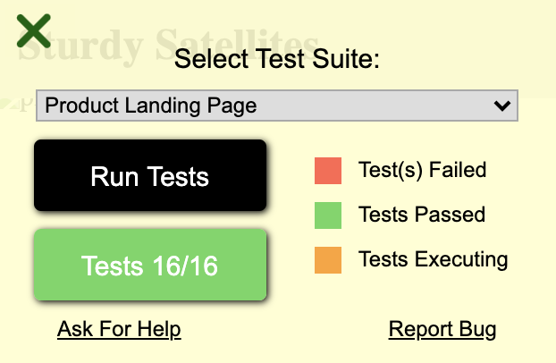

This is Anna Macdonald's completion of [FreeCodeCamp's Product Landing Page project](https://www.freecodecamp.org/learn/responsive-web-design/responsive-web-design-projects/build-a-product-landing-page).

A [preview of Anna's product landing page](http://annafitree.github.io/fcc-product-landing-page)

Tests passed:


Here are some things I learned while doing this project:
* Using \<iframe> with a Youtube URL doesn't work unless you get the embed URL from Youtube.
* When I had:
```
#navbar{
    position: fixed;
    width: 100%;
    display: flex;
}
```
...if I also set padding >0, then the navbar went off the screen to the right. 
I eventually fixed this by setting ```width:auto;``` and ```right:0px;```

* FCC's [sample product page](https://codepen.io/freeCodeCamp/full/RKRbwL), when you click on the navigation links, does not account for the fixed banner height. On my page, I tried to be clever and use a variable to define the height, but since the project doesn't involve using Javascript, I couldn't do something as basic as 'navbar-height+10px' to space the sections, much less dynamically find the actual height after any potential wrapping. So I just manually set the spacing.

* When trying to determine what screen width I should use to switch from nav-links to the (hamburger) menu icon, I set my live-preview browser really skinny and did an inspect to find out how many pixels wide it was. I must not have done that correctly, because it gave me something in the range of 100-150px. When I set my media queries to switch at that width, nothing happened. I tried double that, 300px, and still got no results. After trying other things without success, eventually I tried much larger numbers and finally got it to work. Turns out my computer's minimum browser width is 500px.

* Another problem I ran into was this. The navbar was a flexbox, so I could put the company name on left and the navigation links on the right. I made a div box for the links, so I could use the flexbox's `space-between` option but still put spaces between the links. Originally, the menu icon was in that div. However, I needed to be able to change out the links for the menu icon, and the easiest way to do that was to set the disappearing-css on the div. So I moved the menu icon out of the div. This created the odd problem that, when the screen was wide enough to show the links, even though I had `display: none;` on the menu icon, the browser still acted as if something was filling that space, pushing the links to the left. I tried multiple things (`width:0px` on the icon, `right: -100000px;` on the icon, setting flex grow/shrink rates to 1 or 10 on the business name and links div while making it 0 on the icon) without success. The problem turned out to be that I was applying css to the menu icon directly, but the icon was wrapped in an \<a> link to the place where I had gotten it from. I removed the link, and then using `display: none;` worked.
